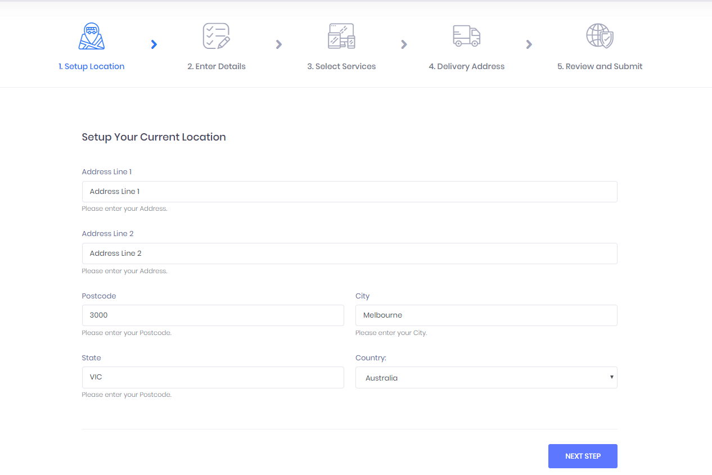
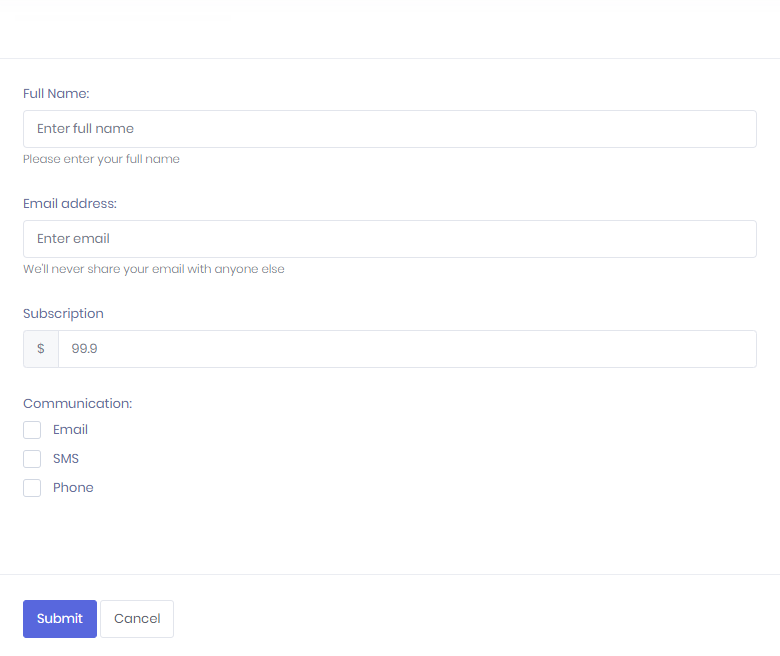

## Hi! I'm Giane, a Freelance Webdesigner

### What I'm currently doing:

I'm currently working for a client that asked me to customize a pre-built theme, so the whole portal would have a consistent view no matter which area the users browse.

### What I did previously:

**2019 (1st semester)** - Marketing Campaign Pages for an online store. I've built specific pages for a Black Friday campaign. Once the pages were ready they were sent through several marketing channels and I also plugged the Google Analytics Infrastructure to keep track of the Visitors.

**2018 (2nd semester)** - Wordpress customization. A client from the construction industry asked me to customize his wordpress site. I was responsible for making the site look like the Zeppelin mocks, it took me several months to get this job done since I also had to fix some bugs in the underlying css.

**2018 (1st semester)** - Template customization for an online pharmacy. The client didn't have a website for his online pharmacy, I was responsible to pick up a suitable template and customize it accordingly to their needs. The code to make the online store to work was built by another developer in php.

### Education:

I currently hold a BS degree in Business Administration and after working in this industry for several years I discovered my passion for all things related to design. It's been 5 years since I left the business industry and switched to UI/UX field where I like to spend my time acting as a freelancer webdesigner.

### Contact:
The best way to reach me is through email [giane_ol@hotmail.com](mailto:giane_ol@hotmail.com)

### Screenshots:

Here are some screenshots of a recent job. I customized the portal to provide a consistent view. The site is based on html 5 and php and has several enterprise features like security based on roles and groups, horizontal scalability and caching.

 

